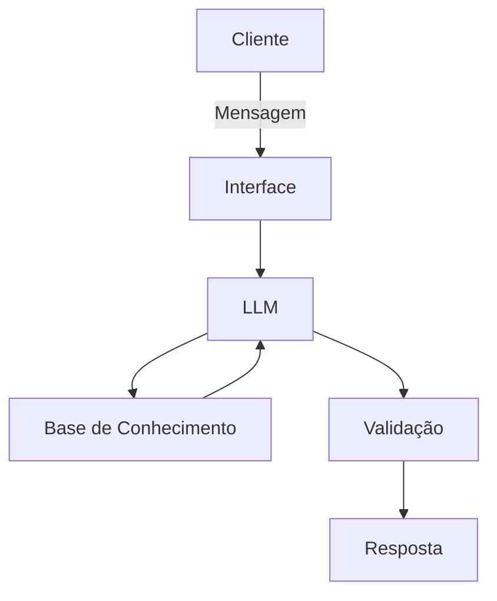

# 🤖 Poupança Poupada — Agente Financeiro Inteligente com IA Generativa

Projeto desenvolvido para o desafio de laboratório da **Digital Innovation One (DIO)**, com o objetivo de idealizar e prototipar um agente financeiro que usa IA Generativa para agir de forma proativa, personalizada e segura.

## Sobre o projeto

Muitos brasileiros deixam dinheiro parado na poupança ou na conta corrente por receio de complexidade ou falta de conhecimento, perdendo poder de compra para a inflação e deixando de rentabilizar com segurança.

O **Poupança Poupada** é um agente que analisa o saldo e o perfil do cliente, identifica valores sem rendimento otimizado e sugere alternativas de baixo risco e liquidez diária (como Tesouro Selic ou CDB Liquidez Diária), traduzindo conceitos financeiros para uma linguagem simples e mostrando os ganhos de forma clara.

**Público-alvo:** pessoas com perfil conservador ou moderado que deixam saldo parado na conta ou na poupança e buscam uma transição segura, sem complicações.

## Persona

- **Nome:** Poupança Poupada
- **Personalidade:** educativa, segura, encorajadora e transparente — trabalha junto com o usuário, sem julgamentos, só aconselhamentos.
- **Tom de voz:** simples e explicativo, focado em metas reais, sem linguajar arrojado.
- **Exemplos de fala:**
  - "Olá! Vamos fazer o dinheiro trabalhar hoje?"
  - "Entendi! Deixa eu verificar isso para você."
  - "Como eu prezo pela sua segurança, só indico investimentos que eu conheço."

## Arquitetura



| Componente | Descrição |
|------------|-----------|
| Interface | [Streamlit](https://streamlit.io/) |
| LLM | Ollama (local, modelo `llama3`) |
| Base de Conhecimento | Arquivos JSON/CSV com dados do cliente, em `data/` |
| Validação | Checagem de alucinações via regras do system prompt |

## Segurança e anti-alucinação

O agente segue algumas regras para evitar respostas inventadas ou inseguras:

- Baseia-se apenas nos dados fornecidos em `produtos_financeiros.json` e `perfil_investidor.json` — nunca inventa taxas ou produtos fora da base.
- Se a reserva de emergência do cliente não estiver completa, sugere apenas produtos de renda fixa de baixo risco e liquidez diária (Tesouro Selic, CDB Liquidez Diária).
- Explica termos técnicos ("CDI", "Selic", "Liquidez") em linguagem simples.
- Quando não sabe algo ou a pergunta foge do escopo financeiro, admite e redireciona a conversa em vez de inventar uma resposta.
- **Limitações declaradas:** não indica investimentos arriscados, não acessa dados sensíveis (senhas e logins) e não substitui profissionais licenciados no tema.

## Base de conhecimento

Os dados mockados de `data/` foram adaptados para dar contexto real ao agente:

| Arquivo | Formato | Uso no agente |
|---------|---------|---------------|
| `transacoes.csv` | CSV | Histórico de transações — ajustado para evidenciar saldo parado na conta corrente e aportes na poupança |
| `historico_atendimento.csv` | CSV | Histórico de atendimentos anteriores — atualizado com dúvidas sobre liquidez e rentabilidade (CDB vs. poupança) |
| `perfil_investidor.json` | JSON | Perfil e preferências do cliente |
| `produtos_financeiros.json` | JSON | Produtos financeiros disponíveis para recomendação |

Os dados são carregados via `pandas` (CSV) e `json` (JSON) e injetados diretamente no prompt como contexto para o modelo.

## Aplicação (`src/app.py`)

Protótipo funcional feito em **Streamlit**, com chat interativo que:

1. Carrega os dados de `data/` (transações, histórico, perfil e produtos).
2. Monta um contexto com essas informações.
3. Envia o contexto + a pergunta do usuário para o Ollama (modelo `llama3`, rodando localmente).
4. Exibe a resposta do agente na interface de chat.

## Testes e observações

O system prompt foi testado em três LLMs diferentes — ChatGPT, Microsoft Copilot e Claude. Nos três casos, as respostas foram baseadas nos dados fornecidos, explicativas e simples para o usuário, e nenhuma das três produziu respostas proibidas (como dados sensíveis) ou saiu do escopo financeiro.

## Estrutura do repositório

```
├── README.md
├── data/                          # Base de dados mockada e adaptada
│   ├── historico_atendimento.csv
│   ├── perfil_investidor.json
│   ├── produtos_financeiros.json
│   └── transacoes.csv
├── docs/                          # Documentação do agente
│   ├── 01-documentacao-agente.md  # Caso de uso, persona e arquitetura
│   ├── 02-base-conhecimento.md    # Estratégia de dados
│   ├── 03-prompts.md              # System prompt e cenários de interação
│   ├── 04-metricas.md             # Avaliação e métricas
│   └── 05-pitch.md                # Roteiro do pitch
├── src/
│   └── app.py                     # Aplicação Streamlit + Ollama
├── assets/
└── examples/
```

## Como rodar

1. Tenha o [Ollama](https://ollama.ai/) instalado e rodando localmente, com o modelo `llama3` disponível.
2. Instale as dependências: `pip install streamlit pandas requests`
3. Rode a aplicação a partir da raiz do projeto: `streamlit run src/app.py`

---

Projeto desenvolvido a partir do desafio [dio-lab-bia-do-futuro](https://github.com/digitalinnovationone/dio-lab-bia-do-futuro) da Digital Innovation One.
